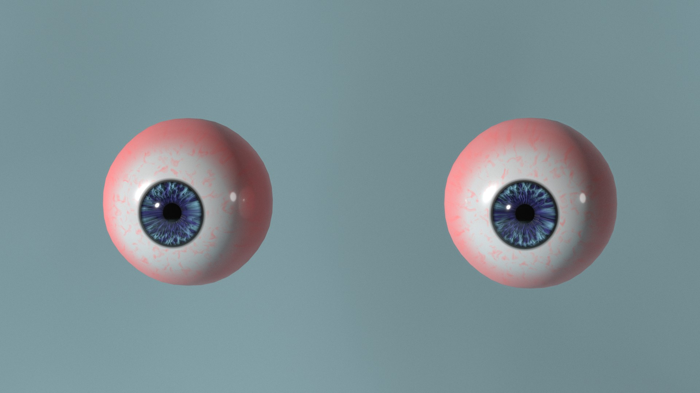

# mpfb-eye-model-v2

This is a workspace for finishing the next version of the procedural eyes

## Working with this repo

Note that the files here are under LFS control, see https://docs.github.com/en/repositories/working-with-files/managing-large-files/installing-git-large-file-storage

